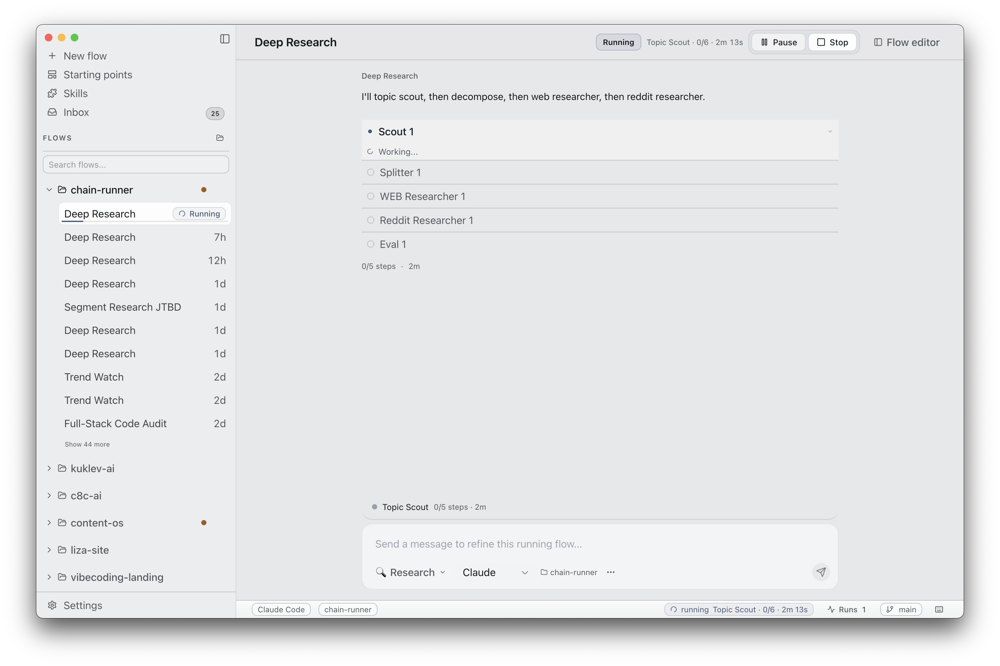

<p align="center">
  
</p>

<h3 align="center">c8c — human-readable AI operations</h3>

<p align="center">
  Turn AI skills into flows with quality checks, approvals, and per-step observability.<br/>
  Works with Claude Code, Codex, and OpenClaw.
</p>

<p align="center">
  <a href="#quickstart"><strong>Quickstart</strong></a> &middot;
  <a href="https://c8c.ai"><strong>Hub</strong></a> &middot;
  <a href="https://github.com/bluzir/c8c"><strong>GitHub</strong></a>
</p>

<p align="center">
  <a href="https://github.com/bluzir/c8c/blob/main/LICENSE"></a>
  <a href="https://github.com/bluzir/c8c/stargazers"></a>
  
  
</p>

<p align="center">
  
</p>

---

## The problem

You run plan → code → review → test → ship with Claude Code every day. Each step is a separate skill, a separate session, a separate copy-paste. You are the orchestrator — the slow loop between steps that otherwise work fine on their own.

Each step passes at ~85%. Chain 5 steps: 44% end-to-end. Without quality checks, errors compound silently. A batch job wrote 847 bad rows to production — zero error signals.

You might already use gstack, superpowers, or GSD — 135K+ GitHub stars combined prove the pattern works. But they run in the terminal, have no quality checks between steps, and die when you walk away.

## What c8c does

c8c turns AI skills into flows you can read, run, and control.

- **Run until it needs you.** Skills execute in sequence. Evaluator nodes catch failures and auto-retry from the step that failed. You intervene only at approval points.
- **Rerun from state, not from scratch.** A step fails? Resume from that step. The rest of the flow stays intact. Come back hours later — the state is durable.
- **Human loop beyond approve/reject.** Approvals, editable review points, human-task forms, inbox with timeout policies. You decide on your schedule.
- **50+ built-in flows.** Dev flow, code audit, content pipeline, competitor analysis, cold outreach, UI polish — pick a flow from the library, paste your input, run it.
- **Full observability after the run ends.** Per-node logs, token usage, duration, active step, typed results — inspectable at any point, not just during execution.

<table>
<tr>
<td width="33%">

**Evaluator checks**<br/>
Score output against criteria. Below threshold → auto-retry from any upstream step. Same model, better harness: 42% → 78% end-to-end success rate.

</td>
<td width="33%">

**Parallel branches**<br/>
Split work into parallel paths. Merge with configurable strategies: concatenate, summarize, or select best. Fan out 20 competitors, merge into one brief.

</td>
<td width="33%">

**Batch processing**<br/>
Run one flow on 50 inputs. Multi-run dashboard tracks each. Failed items retry individually. Export results as CSV or JSON.

</td>
</tr>
<tr>
<td>

**YAML in git**<br/>
Flows are portable YAML files. Commit them with your code. A teammate clones the repo and runs the same flow. No config, no account.

</td>
<td>

**CLI runner**<br/>
`c8c-workflow run`, `resume`, `rerun-from`, `hil approve` — same flow model, headless. Pipe into CI, cron, or OpenClaw for Telegram-triggered runs.

</td>
<td>

**Desktop-first privacy**<br/>
Everything runs on your machine. No cloud accounts, no data leaving your laptop. Free with your existing Claude Code, Codex, or OpenClaw subscription.

</td>
</tr>
</table>

## You, if...

- You run Claude Code skills by hand every day — plan, code, review, test, ship — and the orchestration overhead slows you down.
- You've built a bash script or tmux grid to sequence your AI work, and it keeps breaking.
- You use gstack, superpowers, or GSD and run quality checks by hand between steps.

## Quickstart

Download the latest `.dmg` from [Releases](https://github.com/bluzir/c8c/releases), or build from source:

```bash
git clone https://github.com/bluzir/c8c.git
cd c8c
npm install
npm run dev
```

**Requirements:** Node.js 20+, and at least one of: Claude Code CLI, Codex CLI, or OpenClaw.

> **macOS note:** The app is not code-signed yet. On first launch:
>
> ```bash
> xattr -cr /Applications/c8c.app
> ```
>
> Or right-click → Open → Open.

No custom skills needed to start. Built-in library flows work out of the box. Bring your own skills later.

## How it works

```
Input → [Skill] → [Skill] → [Evaluator] →  pass → [Approval] → [Output]
                                   ↓
                                 fail
                                   ↓
                            [Retry from step N]
```

8 node types cover every pattern:

| Node          | What it does                                                                    |
| ------------- | ------------------------------------------------------------------------------- |
| **Input**     | Entry point — text, URL, directory, or batch data                               |
| **Skill**     | Runs a provider-backed skill with a specific model and prompt                   |
| **Evaluator** | Scores output against criteria, auto-retries from any upstream step on failure  |
| **Splitter**  | Fans out into parallel branches                                                 |
| **Merger**    | Combines parallel results back into one                                         |
| **Approval**  | Human approval — review, edit, approve or return before continuing              |
| **Human**     | General human-task form — collect input, decisions, or structured data mid-flow |
| **Output**    | Final result with named results                                                 |

## FAQ

**How is c8c different from Claude Code or Codex?**

c8c _uses_ those tools. It chains their skills into flows with quality checks, approvals, and per-step observability. Claude Code does the work; c8c runs the flow.

**How is c8c different from n8n?**

Complementary, not competitive. n8n handles triggers and integrations across 1000+ services. c8c handles the AI quality layer: quality checks with auto-retry, approvals, and skill-native execution. For most 3-6 step AI flows, describing what you want and generating YAML is faster than dragging nodes in n8n's editor.

**Can I run flows without the desktop app?**

Yes. `c8c-workflow run flow.yaml` runs the same engine headless. `resume`, `rerun-from`, and `hil approve` work from CLI too. Pipe it into CI, cron, or connect through OpenClaw for Telegram-triggered runs.

**What happens when a step fails?**

You can rerun from that specific step — the rest of the flow keeps its state. No need to restart from the beginning. If the evaluator triggers the failure, it auto-retries from the upstream step you configured.

**Where are my flows stored?**

Project flows live in `{project}/.c8c/*.yaml`. Global flows in `~/.c8c/chains/`. Everything is local files, committable to git.

**Is it really free?**

Open source, MIT license. Runs locally. No account, no server, no fees. Works with your existing Claude Code, Codex, or OpenClaw subscription.

## Development

```bash
npm run dev          # Start Electron with hot reload
npm run build        # Build for production
npm run canon:check  # Check user-facing renderer copy against canon vocabulary
npm run test         # Run all tests
npm run test:watch   # Watch mode
npx tsc --noEmit     # Type-check
```

## Architecture

Electron app with three layers:

- **Main** (`src/main/`) — Electron main process, IPC handlers, flow execution engine
- **Preload** (`src/preload/`) — Context bridge exposing `window.api`
- **Renderer** (`src/renderer/`) — React UI with list-based flow editor and runtime surfaces

Flows are directed graphs defined in YAML. The runtime expands the graph at execution time — splitter nodes create parallel branches, evaluators loop on failure. Each skill node spawns a fresh subprocess with clean context.

**Stack:** Electron 39, React 19, Tailwind CSS 3, Jotai, React Flow, Dagre, Vitest.

## Contributing

c8c is early. The most valuable contributions right now are real flow YAML files, bug reports with reproduction steps, and documentation improvements. Code contributions are welcome too — check issues labeled `good first issue`. If unsure whether something is worth working on, open an issue first.

## Community

- [GitHub Issues](https://github.com/bluzir/c8c/issues) — Bugs and feature requests
- [GitHub Discussions](https://github.com/bluzir/c8c/discussions) — Ideas and RFCs

## License

MIT © 2026 c8c

---

<p align="center">
  <sub>Start with one flow. Grow into a lab.</sub>
</p>
